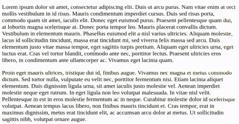

# spotlight-vue

[](https://www.npmjs.com/package/spotlight-vue)

Key activable spotlight for `Vue.js` (initially built for Slidev)



## Installation

```bash
npm i spotlight-vue
```

## Usage

Import with:
```js
import Spotlight from 'spotlight-vue';
```

Register the plugin:
```js
Vue.use(Spotlight);
```

Use it in your `Vue.js` app with:
```vue
<spotlight/>
```

In your app, maintain the <kbd>Control</kbd> key pressed and the spotlight should appear.

## Parameters

* `activationKey` (type: `string`, default: `'Control'`): The key to hold down to activate the spotlight
* `color` (type: `string`, default: `'black'`): CSS color of the spotlight shadow
* `opacity` (type: `number | string`, default: `0.75`): Opacity of the spotlight shadow
* `size` (type: `string`, default: `100px`): Size of the spotlight
* `transitionDuration` (type: `string`, default: `200ms`): CSS transition durations
